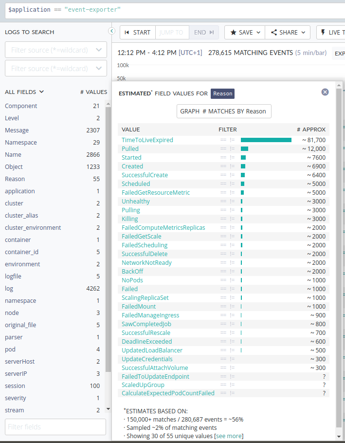

# Kubernetes Event Exporter:

Kubernetes events are stored in the apiserver on master. To avoid filling up master’s disk, a retention policy is enforced: events are removed one hour after the last occurrence.
This Application will listen to live events from the api server and publish them to standard output, with logging agent/watcher installed Like [kubernetes-log-watcher](https://github.com/zalando-incubator/kubernetes-log-watcher "kubernetes-log-watcher"), these events can be exported to central logging system like Scalyr in this case.

## How to use it:

 - In Scalyr select the cluster and then  $application == "event-exporter"
 - event-exporter parser is installed, so you can filter by the below attributes
   - Namespace
   - Level
   - Component
   - Object
   - Resource name
   - Reason
   - Message

## Applying Filters:
 - You can filter (include/exclude) the events to be shipped by using any or all of the above attributes
 - To apply filter create a yaml file with the name "eventRules.yaml" and apply your rules
 - You can add Include and Exclude rules together but better to apply one of them only.
 - Do not create "eventRules.yaml" if you need all events to be shipped/exported.
 - In the value field, you can use string or a list
  - Examples:
    - Include means include only
```bash
      include:
          level: "Warning"
          namespace: ["kube-system"]
          component: "kube-schedule-scaler"
          reason: "Unhealthy"
```
    - Exclude
```bash
      exclude:
          namespace: ["acquire", "bhennessy"]
          reason: ["Started", "Created", "Scheduled", "Pulling", "BackOff", "Pulled"]
          component: ["kube-dns", "kubelet"]
```

#### Example of "Reason" in Scalyr:
 
<p align="center">

</p>

